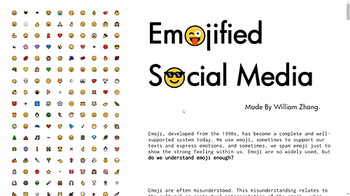

# Emojified-Social-Media  
Spring 2020 Critical Data & Visualization Final Project  

### Project Name: Emojified Social Media  
#### Project Link: https://mstxy.github.io/Emojified-Social-Media/

#### Description  
 The project is based on a raw dataset of 18 million unprocessed English tweets with at least one emojis, as well as a file about the how these emojis are used in Twitter: how many are used in positive, neutral and negative tweets.  

 For the analyze of the data, I calculated the sentiment score for each emoji – if it is used more in negative tweets, then it is more negative than positive. Then, using Python's VADER and NLTK library, I get the text sentiment for each tweet. Other than that, I processed the data to get the average Position of each emoji, Combinations of emojis in each text, the number of times one emoji is Spammed in each text.  

 Therefore, for the project, it is a visualization of my result of the research mainly using d3.js library. It includes five different interactive graphs, each represents one aspect of my result.  

 Hope you enjoy it!  

  

#### Sources:  
EmojifyData-EN: English tweets, with emojis:https://www.kaggle.com/rexhaif/emojifydata-en  
Emoji Sentiment Ranking 1.0:https://www.clarin.si/repository/xmlui/handle/11356/1048  
